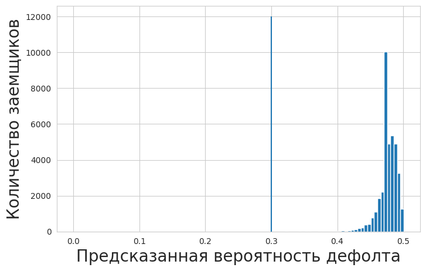
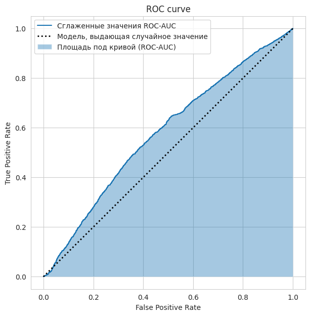

## 1. Выполнение заданий

Задача предсказания дефолта по кредиту является одной из классических задач машинного обучения в банковской сфере. Дефолт наступает, когда просрочка по кредиту превышает 90 дней, что означает неспособность клиента выплатить кредит.

**Цель работы:** Построить модель классификации, которая по анкетным данным заемщика будет предсказывать вероятность дефолта.

#### Используемые методы

В работе были применены два алгоритма машинного обучения:

1. **Логистическая регрессия** - линейная модель для бинарной классификации

2. **Случайный лес (Random Forest)** - ансамблевый метод на основе решающих деревьев

---

## 2. Описание данных

#### Структура данных

Выборка содержит:

- **Обучающая выборка:** 50,000 наблюдений

- **Тестовая выборка:** 37,500 наблюдений

- **Количество признаков:** 11

#### Признаки

| Признак | Описание |
|---------|----------|
| SeriousDlqin2yrs | Целевая переменная: наличие просрочки 90+ дней |
| RevolvingUtilizationOfUnsecuredLines | Доля использованных лимитов по кредитным картам |
| age | Возраст заемщика |
| NumberOfTime30-59DaysPastDueNotWorse | Количество просрочек 30-59 дней за 2 года |
| DebtRatio | Отношение долговых обязательств к доходу |
| MonthlyIncome | Ежемесячный доход |
| NumberOfOpenCreditLinesAndLoans | Количество открытых кредитных линий |
| NumberOfTimes90DaysLate | Количество просрочек 90+ дней за 2 года |
| NumberRealEstateLoansOrLines | Количество ипотечных кредитов |
| NumberOfTime60-89DaysPastDueNotWorse | Количество просрочек 60-89 дней за 2 года |
| NumberOfDependents | Количество иждивенцев |

#### Статистика данных

**Распределение целевой переменной:**

- Клиенты без дефолта: 46,657

- Клиенты с дефолтом: 3,343

---

## 3. Предобработка данных

#### Обработка пропусков

Пропущенные значения были заполнены **средними значениями** соответствующих признаков, рассчитанными по обучающей выборке:

```
train_mean = training_data.mean()
training_data.fillna(train_mean, inplace=True)
test_data.fillna(train_mean, inplace=True)
```

#### Разделение на признаки и целевую переменную

```
target_variable_name = 'SeriousDlqin2yrs'
training_values = training_data[target_variable_name]
training_points = training_data.drop(columns=[target_variable_name])

test_values = test_data[target_variable_name]
test_points = test_data.drop(columns=[target_variable_name])
```

---

## 4. Построение моделей

#### Логистическая регрессия

**Параметры модели:**
```
LogisticRegression(
    C=1.0,
    class_weight='balanced',
    max_iter=1000,
    random_state=42,
    solver='saga'
)
```

**Особенности:**

- Использован параметр `class_weight='balanced'` для компенсации дисбаланса классов

- Увеличено количество итераций до 1000

#### Случайный лес

**Параметры модели:**
```
RandomForestClassifier(
    n_estimators=100,
    random_state=None,
    max_features=None
)
```

**Особенности:**

- Автоматический выбор количества признаков для разбиения

---

## 5. Валидация и оценка качества

#### Точность (Accuracy)

**Результаты:**

| Модель | Accuracy |
|--------|----------|
| Логистическая регрессия | 0.9326 |
| Константный классификатор | 0.9326 |

**Вывод:** Точность логистической регрессии практически совпадает с точностью константного классификатора (который всегда предсказывает 0). Это указывает на то, что accuracy **не является адекватной метрикой** для несбалансированных данных.

#### Таблица сопряженности (Confusion Matrix)

**Логистическая регрессия:**

|         | 0 |  1 |
|---------|---------------|--------------|
| 0 | 34972 | 1 |
| 1 | 2527 | 0 |


**Случайный лес:**

|         | 0 |  1 |
|---------|---------------|--------------|
| 0 | 34454 | 519 |
| 1 | 2031 | 496 |

**Анализ:**

- **True Positive (TP):** Случайный лес обнаружил 519 дефолта из 2527

- **False Positive (FP):** Случайный лес дал 519 ложных срабатываний

**Вывод:** Random Forest значительно лучше обнаруживает дефолты, хотя и допускает некоторое количество ложных срабатываний.

#### ROC-AUC

**Результаты:**

| Модель | ROC-AUC |
|--------|---------|
| Логистическая регрессия | 0.5777679238812652 |
| Случайный лес | **0.8303288768040642** |

**Интерпретация:**

- ROC-AUC логистической регрессии близок к 0.5777679238812652 (случайное угадывание)

- ROC-AUC случайного леса 0.8303288768040642 соответствует **отличному качеству** классификации

#### Влияние порога классификации

Было исследовано влияние порога принятия решения на качество модели:

| Порог | TP | FP | FN | TN |
|-------|----|----|----|----|
| 0.3 | Увеличивается | Увеличивается | Уменьшается | Уменьшается |
| 0.5 (default) | Базовый | Базовый | Базовый | Базовый |
| 0.7 | Уменьшается | Уменьшается | Увеличивается | Увеличивается |

**Итог:**

- **Низкий порог (0.3):** Банк более консервативен, чаще отказывает в кредите (меньше рисков, но меньше прибыль)

- **Высокий порог (0.7):** Банк более агрессивен, чаще выдает кредиты (больше рисков, но больше потенциальная прибыль)

---

## 6. Визуализация результатов

#### Распределение предсказанных вероятностей



#### ROC-кривая



#### ROC-AUC для алгоритма Random Forest(улучшенная)

.png)

---

## 7. Выводы

#### - Сравнение моделей

**Случайный лес значительно превосходит логистическую регрессию:**

- Лучше обнаруживает редкий класс (дефолты)

- ROC-AUC ≥ 0.9 (отличное качество)

- Устойчив к несбалансированности данных

**Логистическая регрессия показала неудовлетворительные результаты:**

- ROC-AUC близок к случайному угадыванию

#### - Метрики качества

**Для несбалансированных данных accuracy не является адекватной метрикой.** Необходимо использовать:

- ROC-AUC

#### - Ссылки

*   [Ссылка на ноутбук с выполненной работой](https://colab.research.google.com/drive/1jadhUW8_M_fGCi60nxve9TmzaEaWHEXw?usp=sharing)