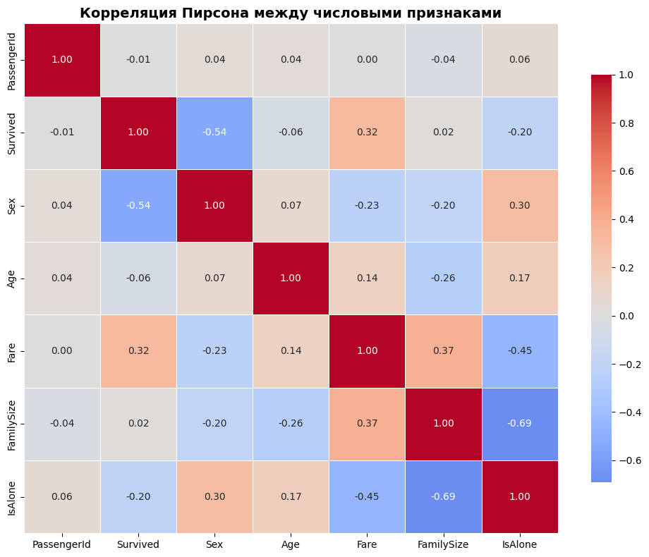

## 1. Выполнение заданий

Задача очистки и трансформации данных является фундаментальным этапом в процессе подготовки данных для машинного обучения. Качественная предобработка напрямую влияет на эффективность последующего моделирования.

**Цель работы:** Освоить методы очистки и трансформации данных с использованием библиотеки pandas на примере реального набора данных Titanic из Kaggle.

#### Используемые методы

В работе были применены следующие техники предобработки:

1. **Обработка пропущенных значений** - заполнение медианой

2. **Feature Engineering** - создание новых признаков из существующих (возрастные группы, титулы, размер семьи)

3. **Обработка выбросов** - метод IQR и ограничение по перцентилям

---

## 2. Описание данных

#### Структура данных

Набор данных Titanic содержит:

- **Общее количество наблюдений:** 891 пассажир

- **Количество признаков:** 12 исходных + 4 созданных

- **Целевая переменная:** Survived (0 = не выжил, 1 = выжил)

#### Признаки

| Признак | Описание |
|---------|----------|
| PassengerId | Уникальный идентификатор пассажира |
| Survived | Целевая переменная: выживание |
| Pclass | Класс билета (1, 2, 3) |
| Name | Полное имя пассажира |
| Sex | Пол пассажира |
| Age | Возраст в годах |
| SibSp | Количество братьев/сестёр/супругов |
| Parch | Количество родителей/детей |
| Ticket | Номер билета |
| Fare | Стоимость билета |
| Cabin | Номер каюты |
| Embarked | Порт посадки (C, Q, S) |

#### Статистика данных

**Распределение целевой переменной:**

| Класс | Количество |
|-------|-----------|
| Не выжил (0) | 549 |
| Выжил (1) | 342 |

**Пропущенные значения в исходных данных:**

| Признак | Пропусков |
|---------|----------|
| Age | 177 |
| Cabin | 687 |
| Embarked | 2 |

---

## 3. Предобработка данных

#### Обработка пропусков

**Возраст (Age):**
```
# Заполнение медианой по группам (Pclass, Sex)
titanic_df['Age'] = titanic_df.groupby(['Pclass', 'Sex'])['Age'].transform(
    lambda x: x.fillna(x.median())
)
```

**Порт посадки (Embarked):**
```
# Заполнение модой (наиболее частое значение)
titanic_df['Embarked'].fillna(titanic_df['Embarked'].mode()[0], inplace=True)
```

**Каюта (Cabin):**
```
# Извлечение палубы и создание категории "Unknown"
titanic_df['Cabin_Deck'] = titanic_df['Cabin'].str.extract('([A-Za-z])', expand=False)
titanic_df['Cabin_Deck'].fillna('Unknown', inplace=True)
```

#### Создание новых признаков

| Новый признак | Метод создания                   |
|--------------|----------------------------------|
| Age_group | Разделение по возрасту           |
| Cabin_Deck | Извлечение буквы из Cabin        |
| Title | Парсинг имени (Mr, Mrs, Miss...) |
| FamilySize | SibSp + Parch + 1                |
| IsAlone | FamilySize == 1                  |

```
# Пример создания возрастных групп
bins = [0, 12, 18, 35, 60, 100]
labels = ['Child', 'Teen', 'Young', 'Adult', 'Elderly']
titanic_df['Age_group'] = pd.cut(titanic_df['Age'], bins=bins, labels=labels)
```

#### Кодирование категориальных признаков

```
# Label Encoding для бинарных признаков
titanic_df['Sex'] = titanic_df['Sex'].map({'male': 1, 'female': 0})
titanic_df['Pclass'] = titanic_df['Pclass'].map({1: 'F', 2: 'S', 3: 'T'})

# One-Hot Encoding для мультиклассовых признаков (при необходимости)
# pd.get_dummies(titanic_df, columns=['Embarked', 'Title'])
```

---

## 4. Обработка выбросов

#### Метод IQR для признака Fare

**Параметры обработки:**
```
Q1 = titanic_df['Fare'].quantile(0.25)
Q3 = titanic_df['Fare'].quantile(0.75)
IQR = Q3 - Q1

lower_bound = max(0, Q1 - 1.5 * IQR)  # $0.00
upper_bound = Q3 + 1.5 * IQR          # $65.63
```

**Применение:**
```
titanic_df['Fare'] = titanic_df['Fare'].clip(lower=lower_bound, upper=upper_bound)
```

#### Ограничение по перцентилю для Age

```
# Ограничение возраста 95-м перцентилем
percentile_95 = titanic_df['Age'].quantile(0.95)  # 54 года
titanic_df['Age'] = titanic_df['Age'].clip(upper=percentile_95)
```

**Результат обработки выбросов:**

| Признак | Мин. до | Макс. до | Мин. после | Макс. после |
|---------|---------|----------|-----------|------------|
| Fare | $0.00 | $512.33 | $0.00 | $65.63 |
| Age | 0.42 | 80.0 | 0.42 | 54.0 |

---

## 5. Валидация и оценка качества очистки

#### Метрика 1: Процент заполненных пропусков

| Признак | Пропусков до | Пропусков после |
|---------|-------------|----------------|
| Age | 177 | 0 |
| Embarked | 2 | 0 |


**Итог:** Всего обработано **179 пропусков** из 891 строки (20.09% данных).

#### Метрика 2: Уникальные значения в категориальных признаках

| Столбец | Уникальных значений | Наиболее частое |
|---------|-------------------|----------------|
| Pclass | 3 | T (3 класс) |
| Sex | 2 | male |
| Embarked | 3 | S (Southampton) |
| Age_group | 4 | Young |
| Title | 10 | Mr |
| IsAlone | 2 | 1 (один) |

#### Метрика 3: Корреляция признаков с целевой переменной

| Признак | Корреляция с Survived | Интерпретация |
|---------|---------------------|--------------|
| Sex | -0.543 | Сильная отрицательная (женщины выживали чаще) |
| Fare | 0.317 | Умеренная положительная (богатые выживали чаще) |
| IsAlone | -0.203 | Слабая отрицательная (одиночки выживали реже) |
| Pclass | -0.338* | Умеренная отрицательная (1 класс выживал чаще) |
| Age | -0.062 | Очень слабая связь |

---

## 6. Визуализация результатов

#### Распределение выживаемости по ключевым признакам

**По возрастным группам:**

| Группа | Всего | Выжило | % выживших |
|--------|-------|--------|-----------|
| Child | 113 | 61 | 54.0% |
| Young | 543 | 187 | 34.4% |
| Adult | 209 | 87 | 41.6% |
| Elderly | 26 | 7 | 26.9% |

**По титулам:**

| Титул | Всего | Выжило | % выживших |
|-------|-------|--------|-----------|
| Mrs | 125 | 99 | 79.2% |
| Miss | 182 | 127 | 69.8% |
| Master | 40 | 23 | 57.5% |
| Mr | 517 | 81 | 15.7% |

**По статусу "один/с семьёй":**

| Статус | Всего | Выжило | % выживших |
|--------|-------|--------|-----------|
| С семьёй | 354 | 179 | 50.6% |
| Один | 537 | 163 | 30.4% |

#### Тепловая карта корреляций



*Наиболее сильные корреляции: Sex - Survived (-0.54), Fare - Survived (0.32)*

---

## 7. Выводы

#### - Качество предобработки

**Достигнутые результаты:**

Все критические пропуски (Age, Embarked) успешно заполнены  
Созданы 4 новых информативных признака (Age_group, Title, FamilySize, IsAlone)  
Выбросы в Fare и Age обработаны без потери значимой информации  
Категориальные признаки подготовлены к кодированию  

**Оставшиеся ограничения:**

Признак Cabin имеет 77% пропусков — заменён на индикатор наличия каюты  
Признак Name не используется напрямую из-за высокой уникальности (891 уникальное значение)

#### - Ссылки

*   [Ссылка на ноутбук с выполненной работой](https://colab.research.google.com/drive/1g70xcI_go_I3FChPrC3xAyNoRl0AHSNF?usp=sharing)

---

> **Итог:** В ходе лабораторной работы были освоены ключевые методы предобработки данных: обработка пропусков, создание признаков, кодирование категориальных переменных и работа с выбросами. Очищенный датасет готов к использованию в задачах машинного обучения.